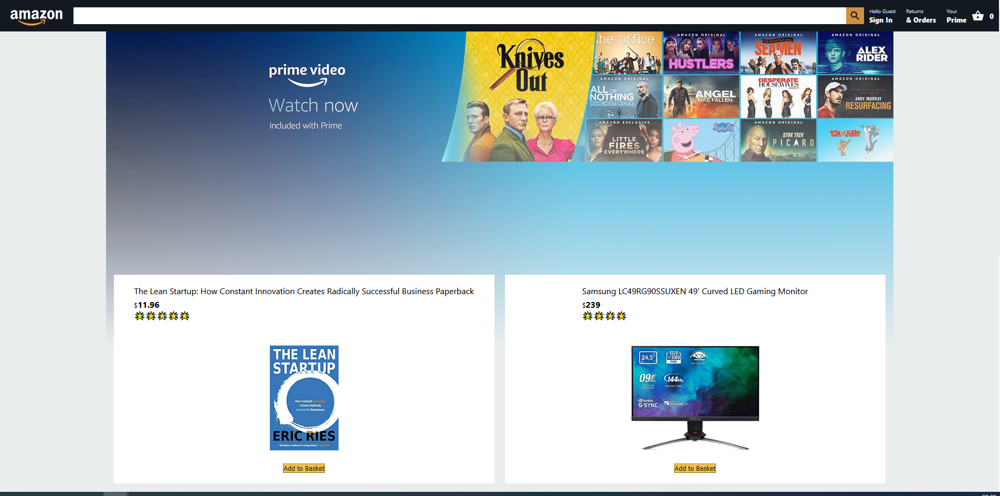

# Amazon Clone React App

This Project is a beginner friendly project I built using React. Some key Aspects:

-  Firebase Backend
-  Firebase Authentication
-  Firebase DataStore
-  Firebase Cloud Function with Express API(functions directory)
-  Payments with Stripe API
-  Front-end with React js

Deployed live using Firebase on https://clone-fa0a1.web.app/

## Available Scripts for Front-End App

In the project directory, you can run:

### `npm start`

Runs the app in the development mode.\
Open [http://localhost:3000](http://localhost:3000) to view it in the browser.

### `yarn test`

Launches the test runner in the interactive watch mode.\

### `npm build`

Builds the app for production to the `build` folder.\
It correctly bundles React in production mode and optimizes the build for the best performance.

## Available Scripts for Back-End Cloud Function Firebase Express API

Inside functions folder run:

### `npm run deploy`

## Firebase Deployment APP Steps With Firebase

-  firebase login
-  firebase init
   -  Option Hosting: Configure and deploy Firebase Hosting sites
   -  Use and existing project
   -  Choose Project in Firebase Account
   -  Use as public directory -> build
   -  Single Page -> Yes
   -  Setup Automatic Builds with Github -> No
-  npm run build
-  firebase deploy

